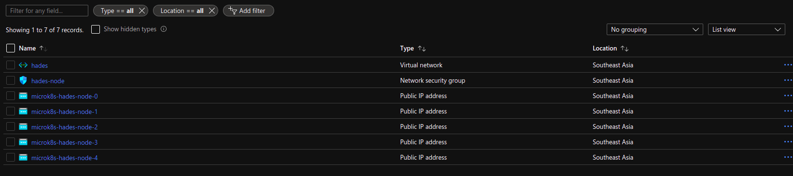

# Azure Terraform Microk8s

**This currently works from `1.19+` channel.**

Bootstrap an Highly available MicroK8s in Azure with Terraform.

For example to bootstrap a 3 node MicroK8s.

```hcl
module "az-microk8s" {
    source = "git::https://github.com/balchua/az-microk8s"
    region = "southeastasia"
    cluster_name = "hades"
    host_cidr = "10.0.0.0/16" 
    node_type = "Standard_DS3_v2"
    node_count = "3"
    microk8s_channel = "latest/stable"
    cluster_token_ttl_seconds = 3600    
}

```

| Fields                        | Description                              | Default values |
| ----------------------------- |:-----------------------------------------| -------------- |
| source                        | The source of the terraform module       | none
| cluster_name                  | The cluster name.  Each node will be infixed by this cluster name| `cetacean`
| host_cidr                     | Your Azure compute CIDR | `10.0.0.0/16`
| node_type                     | The type of node to provision | `Standard_DS3_V2`
| node_count                    | The number of MicroK8s nodes to create   | `3`
| region                        | Azure region <br/> To get the list of regions `az account list-locations -o table`| `southeastasia`
| microk8s_channel              | Specify the MicroK8s channel to use.  Refer [here](https://snapcraft.io/microk8s)| `edge`
| cluster_token_ttl_seconds     | How long the token validity (in seconds)| `3600`
| ssh_public_key                | The location of your public key to use to connect to the Azure compute| `~/.ssh/id_rsa.pub`
| ssh_private_key               | The location of your private key.  Used to connect to the Azure compute instances| `~/.ssh/id_rsa`

**The `cluster_token` must be 32 alphanumeric characters long.**

## Azure TF environment variables

You must have these environment variables present.

```shell

# Azure stuffs
ARM_SUBSCRIPTION_ID=<your subscription id>
ARM_CLIENT_ID=<your client id>
ARM_CLIENT_SECRET=<your client secret>
ARM_TENANT_ID=<your tenant id>

TF_VAR_client_id=<your client id, same as ARM_CLIENT_ID>
TF_VAR_client_secret=<your client secret, same as ARM_CLIENT_SECRET>

```

## Creating the cluster

Simply run the `terraform plan` and then `terraform apply`.

In the [example](example/main.tf), it creates a 5 node MicroK8s cluster, using the `latest/edge` channel.  This will take sometime.
You will start to see the resources being created in Azure.



After the creation, you can now see all the nodes together.

__It takes a few minutes to bootstrap the cluster.__

Once terraform completes, you should be able to see the cluster.

## Where is Kube config file?

The module automatically downloads the kubeconfig file to your local machine in `/tmp/client.config`
In order to access the Kubernetes cluster from your local machine.

`export KUBECONFIG=/tmp/client.config`

You should have access to the cluster.

Example:


```shell

kubectl get no -o wide
NAME                    STATUS   ROLES    AGE     VERSION                     INTERNAL-IP   EXTERNAL-IP   OS-IMAGE             KERNEL-VERSION     CONTAINER-RUNTIME
microk8s-hades-node-3   Ready    <none>   3m50s   v1.20.5-38+3ca04ba497fd4a   10.0.128.5    <none>        Ubuntu 20.04.2 LTS   5.4.0-1043-azure   containerd://1.4.3
microk8s-hades-node-2   Ready    <none>   17m     v1.20.5-38+3ca04ba497fd4a   10.0.128.4    <none>        Ubuntu 20.04.2 LTS   5.4.0-1043-azure   containerd://1.4.3
microk8s-hades-node-0   Ready    <none>   25m     v1.20.5-38+3ca04ba497fd4a   10.0.128.7    <none>        Ubuntu 20.04.2 LTS   5.4.0-1043-azure   containerd://1.4.3
microk8s-hades-node-4   Ready    <none>   70s     v1.20.5-38+3ca04ba497fd4a   10.0.128.6    <none>        Ubuntu 20.04.2 LTS   5.4.0-1043-azure   containerd://1.4.3
microk8s-hades-node-1   Ready    <none>   20m     v1.20.5-38+3ca04ba497fd4a   10.0.128.8    <none>        Ubuntu 20.04.2 LTS   5.4.0-1043-azure   containerd://1.4.3

```

## Enabling addons

To enable addons, user must `ssh` into the master node, using the public IP.

The user to use is `ubuntu`.  In this example, we are enabling `linkerd`.


```shell
$ ubuntu@microk8s-hades-node-3:$ microk8s enable linkerd
Fetching Linkerd2 version v2.9.4.
2.9.4
  % Total    % Received % Xferd  Average Speed   Time    Time     Time  Current
                                 Dload  Upload   Total   Spent    Left  Speed
100   645  100   645    0     0   1557      0 --:--:-- --:--:-- --:--:--  1557
100 39.2M  100 39.2M    0     0  12.8M      0  0:00:03  0:00:03 --:--:-- 17.5M
Enabling Linkerd2
Enabling DNS
Applying manifest
serviceaccount/coredns created
configmap/coredns created
deployment.apps/coredns created
service/kube-dns created
clusterrole.rbac.authorization.k8s.io/coredns created
clusterrolebinding.rbac.authorization.k8s.io/coredns created
Restarting kubelet
Adding argument --cluster-domain to nodes.
Configuring node 10.0.128.5
Configuring node 10.0.128.4
Configuring node 10.0.128.7
Configuring node 10.0.128.6
Configuring node 10.0.128.8
Adding argument --cluster-dns to nodes.
Configuring node 10.0.128.5
Configuring node 10.0.128.4
Configuring node 10.0.128.7
Configuring node 10.0.128.6
Configuring node 10.0.128.8
Restarting nodes.
Configuring node 10.0.128.5
Configuring node 10.0.128.4
Configuring node 10.0.128.7
Configuring node 10.0.128.6
Configuring node 10.0.128.8
DNS is enabled
WARN[0000] could not set namespace from kubectl context, using 'default' namespace: invalid configuration: no configuration has been provided, try setting KUBERNETES_MASTER environment variable
		 ensure the KUBECONFIG path  is valid 
namespace/linkerd created
clusterrole.rbac.authorization.k8s.io/linkerd-linkerd-identity created
clusterrolebinding.rbac.authorization.k8s.io/linkerd-linkerd-identity created
serviceaccount/linkerd-identity created
clusterrole.rbac.authorization.k8s.io/linkerd-linkerd-controller created
clusterrolebinding.rbac.authorization.k8s.io/linkerd-linkerd-controller created
serviceaccount/linkerd-controller created
clusterrole.rbac.authorization.k8s.io/linkerd-linkerd-destination created
clusterrolebinding.rbac.authorization.k8s.io/linkerd-linkerd-destination created
serviceaccount/linkerd-destination created
role.rbac.authorization.k8s.io/linkerd-heartbeat created
rolebinding.rbac.authorization.k8s.io/linkerd-heartbeat created
serviceaccount/linkerd-heartbeat created
role.rbac.authorization.k8s.io/linkerd-web created
rolebinding.rbac.authorization.k8s.io/linkerd-web created
clusterrole.rbac.authorization.k8s.io/linkerd-linkerd-web-check created
clusterrolebinding.rbac.authorization.k8s.io/linkerd-linkerd-web-check created
clusterrolebinding.rbac.authorization.k8s.io/linkerd-linkerd-web-admin created
serviceaccount/linkerd-web created
Warning: apiextensions.k8s.io/v1beta1 CustomResourceDefinition is deprecated in v1.16+, unavailable in v1.22+; use apiextensions.k8s.io/v1 CustomResourceDefinition
customresourcedefinition.apiextensions.k8s.io/serviceprofiles.linkerd.io created
customresourcedefinition.apiextensions.k8s.io/trafficsplits.split.smi-spec.io created
clusterrole.rbac.authorization.k8s.io/linkerd-linkerd-proxy-injector created
clusterrolebinding.rbac.authorization.k8s.io/linkerd-linkerd-proxy-injector created
serviceaccount/linkerd-proxy-injector created
secret/linkerd-proxy-injector-k8s-tls created
Warning: admissionregistration.k8s.io/v1beta1 MutatingWebhookConfiguration is deprecated in v1.16+, unavailable in v1.22+; use admissionregistration.k8s.io/v1 MutatingWebhookConfiguration
mutatingwebhookconfiguration.admissionregistration.k8s.io/linkerd-proxy-injector-webhook-config created
clusterrole.rbac.authorization.k8s.io/linkerd-linkerd-sp-validator created
clusterrolebinding.rbac.authorization.k8s.io/linkerd-linkerd-sp-validator created
serviceaccount/linkerd-sp-validator created
secret/linkerd-sp-validator-k8s-tls created
Warning: admissionregistration.k8s.io/v1beta1 ValidatingWebhookConfiguration is deprecated in v1.16+, unavailable in v1.22+; use admissionregistration.k8s.io/v1 ValidatingWebhookConfiguration
validatingwebhookconfiguration.admissionregistration.k8s.io/linkerd-sp-validator-webhook-config created
clusterrole.rbac.authorization.k8s.io/linkerd-linkerd-tap created
clusterrole.rbac.authorization.k8s.io/linkerd-linkerd-tap-admin created
clusterrolebinding.rbac.authorization.k8s.io/linkerd-linkerd-tap created
clusterrolebinding.rbac.authorization.k8s.io/linkerd-linkerd-tap-auth-delegator created
serviceaccount/linkerd-tap created
rolebinding.rbac.authorization.k8s.io/linkerd-linkerd-tap-auth-reader created
secret/linkerd-tap-k8s-tls created
apiservice.apiregistration.k8s.io/v1alpha1.tap.linkerd.io created
podsecuritypolicy.policy/linkerd-linkerd-control-plane created
role.rbac.authorization.k8s.io/linkerd-psp created
rolebinding.rbac.authorization.k8s.io/linkerd-psp created
configmap/linkerd-config created
secret/linkerd-identity-issuer created
service/linkerd-identity created
service/linkerd-identity-headless created
deployment.apps/linkerd-identity created
service/linkerd-controller-api created
deployment.apps/linkerd-controller created
service/linkerd-dst created
service/linkerd-dst-headless created
deployment.apps/linkerd-destination created
cronjob.batch/linkerd-heartbeat created
service/linkerd-web created
deployment.apps/linkerd-web created
deployment.apps/linkerd-proxy-injector created
service/linkerd-proxy-injector created
service/linkerd-sp-validator created
deployment.apps/linkerd-sp-validator created
service/linkerd-tap created
deployment.apps/linkerd-tap created
serviceaccount/linkerd-grafana created
configmap/linkerd-grafana-config created
service/linkerd-grafana created
deployment.apps/linkerd-grafana created
clusterrole.rbac.authorization.k8s.io/linkerd-linkerd-prometheus created
clusterrolebinding.rbac.authorization.k8s.io/linkerd-linkerd-prometheus created
serviceaccount/linkerd-prometheus created
configmap/linkerd-prometheus-config created
service/linkerd-prometheus created
deployment.apps/linkerd-prometheus created
secret/linkerd-config-overrides created
Linkerd is starting
```

Finally from your local machine, you can see all the resources in your kubernetes cluster.

```shell
 kubectl get all -A 
NAMESPACE     NAME                                          READY   STATUS    RESTARTS   AGE
kube-system   pod/calico-node-mqbrb                         1/1     Running   0          8m7s
kube-system   pod/calico-node-tj9nm                         1/1     Running   0          5m27s
kube-system   pod/calico-node-tdcw4                         1/1     Running   0          21m
kube-system   pod/calico-node-w28nt                         1/1     Running   0          26m
kube-system   pod/calico-kube-controllers-847c8c99d-7r9kb   1/1     Running   0          30m
kube-system   pod/calico-node-ftqgs                         1/1     Running   0          24m
kube-system   pod/coredns-86f78bb79c-xwqrr                  1/1     Running   0          4m25s
linkerd       pod/linkerd-identity-5cfbd86c4-c6m2q          2/2     Running   0          3m6s
linkerd       pod/linkerd-sp-validator-7984b485b9-pwm9s     2/2     Running   0          3m7s
linkerd       pod/linkerd-destination-56d65d5c49-vtjzg      2/2     Running   0          3m4s
linkerd       pod/linkerd-proxy-injector-78df99b6dd-cjbwv   2/2     Running   0          3m7s
linkerd       pod/linkerd-web-7dbfcdf9d-bxt9l               2/2     Running   0          3m7s
linkerd       pod/linkerd-controller-68d58bb5d9-xqxlt       2/2     Running   0          3m7s
linkerd       pod/linkerd-tap-845fc9dd99-mqm2g              2/2     Running   0          3m5s
linkerd       pod/linkerd-grafana-555d77d9cf-l9fsw          2/2     Running   0          3m7s
linkerd       pod/linkerd-prometheus-7948496b7b-thz59       2/2     Running   0          3m5s

NAMESPACE     NAME                                TYPE        CLUSTER-IP       EXTERNAL-IP   PORT(S)                  AGE
default       service/kubernetes                  ClusterIP   10.152.183.1     <none>        443/TCP                  30m
kube-system   service/kube-dns                    ClusterIP   10.152.183.10    <none>        53/UDP,53/TCP,9153/TCP   4m27s
linkerd       service/linkerd-identity            ClusterIP   10.152.183.196   <none>        8080/TCP                 3m18s
linkerd       service/linkerd-identity-headless   ClusterIP   None             <none>        8080/TCP                 3m18s
linkerd       service/linkerd-controller-api      ClusterIP   10.152.183.111   <none>        8085/TCP                 3m17s
linkerd       service/linkerd-dst                 ClusterIP   10.152.183.95    <none>        8086/TCP                 3m17s
linkerd       service/linkerd-dst-headless        ClusterIP   None             <none>        8086/TCP                 3m17s
linkerd       service/linkerd-web                 ClusterIP   10.152.183.249   <none>        8084/TCP,9994/TCP        3m16s
linkerd       service/linkerd-proxy-injector      ClusterIP   10.152.183.113   <none>        443/TCP                  3m16s
linkerd       service/linkerd-sp-validator        ClusterIP   10.152.183.79    <none>        443/TCP                  3m16s
linkerd       service/linkerd-tap                 ClusterIP   10.152.183.207   <none>        8088/TCP,443/TCP         3m15s
linkerd       service/linkerd-grafana             ClusterIP   10.152.183.123   <none>        3000/TCP                 3m15s
linkerd       service/linkerd-prometheus          ClusterIP   10.152.183.104   <none>        9090/TCP                 3m14s

NAMESPACE     NAME                         DESIRED   CURRENT   READY   UP-TO-DATE   AVAILABLE   NODE SELECTOR            AGE
kube-system   daemonset.apps/calico-node   5         5         5       5            5           kubernetes.io/os=linux   30m

NAMESPACE     NAME                                      READY   UP-TO-DATE   AVAILABLE   AGE
kube-system   deployment.apps/calico-kube-controllers   1/1     1            1           30m
kube-system   deployment.apps/coredns                   1/1     1            1           4m27s
linkerd       deployment.apps/linkerd-identity          1/1     1            1           3m17s
linkerd       deployment.apps/linkerd-sp-validator      1/1     1            1           3m16s
linkerd       deployment.apps/linkerd-proxy-injector    1/1     1            1           3m16s
linkerd       deployment.apps/linkerd-destination       1/1     1            1           3m17s
linkerd       deployment.apps/linkerd-web               1/1     1            1           3m16s
linkerd       deployment.apps/linkerd-controller        1/1     1            1           3m17s
linkerd       deployment.apps/linkerd-tap               1/1     1            1           3m15s
linkerd       deployment.apps/linkerd-grafana           1/1     1            1           3m15s
linkerd       deployment.apps/linkerd-prometheus        1/1     1            1           3m14s

NAMESPACE     NAME                                                DESIRED   CURRENT   READY   AGE
kube-system   replicaset.apps/calico-kube-controllers-847c8c99d   1         1         1       30m
kube-system   replicaset.apps/coredns-86f78bb79c                  1         1         1       4m27s
linkerd       replicaset.apps/linkerd-identity-5cfbd86c4          1         1         1       3m7s
linkerd       replicaset.apps/linkerd-sp-validator-7984b485b9     1         1         1       3m8s
linkerd       replicaset.apps/linkerd-proxy-injector-78df99b6dd   1         1         1       3m8s
linkerd       replicaset.apps/linkerd-destination-56d65d5c49      1         1         1       3m6s
linkerd       replicaset.apps/linkerd-web-7dbfcdf9d               1         1         1       3m8s
linkerd       replicaset.apps/linkerd-controller-68d58bb5d9       1         1         1       3m8s
linkerd       replicaset.apps/linkerd-tap-845fc9dd99              1         1         1       3m7s
linkerd       replicaset.apps/linkerd-grafana-555d77d9cf          1         1         1       3m8s
linkerd       replicaset.apps/linkerd-prometheus-7948496b7b       1         1         1       3m6s

NAMESPACE   NAME                              SCHEDULE    SUSPEND   ACTIVE   LAST SCHEDULE   AGE
linkerd     cronjob.batch/linkerd-heartbeat   0 0 * * *   False     0        <none>          3m16s

```

